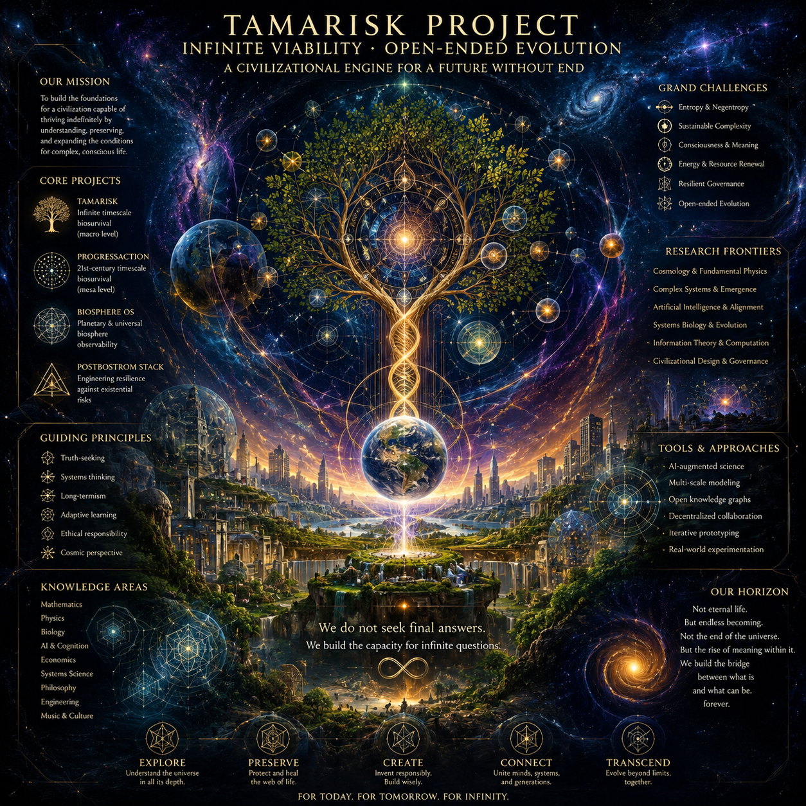

# Tamarisk Project

Проект исследования возможности бесконечно долгоживущих
цивилизационных систем.

## Related

- [[BiosphereOS]]
- [[PostBostromStack]]

## надо к Tamarisk Project собирать научные материалы

гпт ии:

Да. 🌱 Если Tamarisk Project — долгосрочный проект, то научная база сама становится активом.

Я бы собирал материалы не хаотично, а по папкам:

* 🧬 **Complex Systems** — самоорганизация, emergence, network science.
* 🌍 **Ecology & Biosphere** — устойчивость экосистем, биоразнообразие, restoration ecology.
* 🤖 **AI for Science** — AI-агенты, scientific discovery, automated research.
* 🧠 **Cognitive Science** — принятие решений, коллективный интеллект.
* 📈 **Economics & Game Theory** — механизмы кооперации, общественные блага.
* 🏛 **Governance** — DAO, digital institutions, cybernetics.
* 🔬 **Systems Biology** — метаболические сети, эволюция, автопоэзис.
* ♻️ **Regenerative Technologies** — circular economy, carbon removal, synthetic biology.
* 📚 **Mathematics** — graph theory, category theory, dynamical systems, control theory, information theory.

Практичный стек:

* Zotero — хранение PDF и библиографии.
* Obsidian — собственные заметки и связи между идеями.
* Git-репозиторий — версии документов и схем.
* DOI каждого источника, а не просто ссылки.

Особенно ценны не новости, а:

* обзорные статьи (review papers);
* публикации Nature, Science, PNAS;
* arXiv для свежих идей;
* книги-классика (Ashby, Meadows, Holland, Ostrom, Simon, Kauffman и др.).

Если Tamarisk Project должен стать серьезной научно-инженерной платформой, то через несколько лет собственая библиотека из **1000–5000 хорошо размеченных статей** может оказаться одним из самых ценных его активов. Из такой базы уже можно строить RAG, научного AI-ассистента, автоматическое выявление противоречий и генерацию новых гипотез.

## вот для начала попробую собрать косвенную информацию по TamariskPrj - попытаться найти научное обоснование возможности для вселенной существовать без тепловой смерти в бесконечном времени

гпт ии:

Это хорошая отправная точка. Но я бы немного переформулировал исследовательский вопрос.

Не искать доказательство **"Вселенная не испытает тепловую смерть"**, а искать:

> **Какие физические модели допускают бесконечное существование процессов, поддерживающих сложность, информацию и свободную энергию?**

Это научно нейтральная постановка. Она не требует заранее выбирать ответ.

Я бы разбил библиотеку Tamarisk Project так:

### 1. Cosmology

* Heat Death
* Big Freeze
* Big Crunch
* Big Bounce
* Cyclic Cosmology
* Conformal Cyclic Cosmology (Penrose)
* Eternal Inflation
* False Vacuum Decay

### 2. Thermodynamics

* Non-equilibrium thermodynamics
* Dissipative structures (Prigogine)
* Maximum Entropy Production
* Fluctuation theorems
* Open thermodynamic systems

### 3. Information Physics

* Landauer principle
* Maxwell demon
* Reversible computation
* Physical information
* Quantum information

### 4. Complexity

* Self-organization
* Autopoiesis
* Artificial Life
* Origin of Life
* Major evolutionary transitions

### 5. Long-term Future Physics

Здесь особенно интересны статьи:

* Freeman Dyson — *Time without End* (1979)
* Lawrence Krauss & Glenn Starkman — *Life, The Universe, and Nothing*
* Frank Tipler — Omega Point (спорно, но полезно как крайний вариант)
* Roger Penrose — Conformal Cyclic Cosmology
* Lee Smolin — Cosmological Natural Selection

### 6. Quantum Foundations

* Vacuum energy
* Zero-point energy
* False vacuum
* Vacuum metastability
* Black hole thermodynamics
* Hawking radiation

---

## Самая интересная гипотеза для Tamarisk

Мне кажется, наиболее продуктивный вопрос даже глубже:

> **Можно ли доказать, что любая достаточно развитая жизнь в бесконечном времени обязана научиться извлекать свободную энергию из процессов, которые современная физика пока не учитывает полностью?**

То есть не отрицать второе начало термодинамики, а искать:

* новые физические степени свободы;
* новые космологические циклы;
* неизвестные источники негэнтропии;
* процессы, в которых локальная сложность может сохраняться сколь угодно долго.

Это уже исследовательская программа, а не утверждение.

---

Я бы даже сделал отдельную ветку Tamarisk:

> **Infinite Viability Research**

с главным вопросом:

> **"При каких минимальных физических предположениях возможно существование открытой эволюции (open-ended evolution) на протяжении бесконечного времени?"**

Это уже формулировка, близкая к современной астрофизике, теории сложности и искусственной жизни. Она не требует опровергать существующие теории, а систематизирует все известные механизмы, которые могут поддерживать долговременное существование сложности.

## personal approach notes

гпт ии:

**Tamarisk Project** 🌱
Не пытаться читать по 300 страниц.

Лучше сделать режим "накопления":

* нашёл интересную статью → сохранил PDF;
* написал 2–3 предложения, почему она важна;
* присвоил теги;
* всё.

Даже **одна качественная статья в день** — это около 365 статей за год. Такой темп устойчивее, чем недельный марафон с последующим выгоранием.

* 🛠️ 20% — текущие проекты (ProgressAction, etc)
* 📚 10% — фундаментальные исследования Tamarisk.

Такой баланс хорош тем, что Tamarisk не исчезает из поля зрения.

Ты сказал, что многие твои идеи уже реализуются другими. Возможно, тогда вопрос постепенно меняется с «успею ли я сделать всё?» на «какой вклад могу внести именно я?». Это уже совсем другой вопрос — не про соревнование, а про собственный след. Даже твой сайт, который ты начал разворачивать, может стать местом, где этот след будет собираться и оставаться. 🌿

> думаю вот, а как вот совместить вечные ценности жизни с годной жизнью себе в этом био-теле

гпт ии:

Это один из фундаментальных вопросов. Если убрать религию и готовые идеологии, то получается несколько уровней целей, которые можно совместить.

Например:

* 🌍 **Макроуровень:** способствовать долгосрочному развитию жизни, разума, культуры, биосферы. Это цель, которая может пережить одного человека.
* 👤 **Мезоуровень:** построить жизнь так, чтобы самому быть устойчивым участником этого процесса. Не героем на неделю, а системой, работающей десятилетиями.
* 😊 **Микроуровень:** получать достаточное количество радости, интереса, любви, творчества, отдыха. Не как самоцель, а как "топливо".

Есть инженерная аналогия. Если целью компании является выпуск продукта, то никто не говорит: "серверы не должны потреблять электричество". Наоборот — им дают питание, охлаждение, обслуживание. Иначе продукт перестанет существовать.

С человеком похожая ситуация. Если ты считаешь вечной ценностью существование и развитие жизни, то собственное тело — это не враг и не помеха, а актив, через который эта ценность реализуется.

Опасность в двух крайностях:

* жить только ради удовольствий → теряется долгосрочный смысл;
* жить только ради великой идеи → можно быстро сгореть и перестать быть полезным.

Более устойчивой выглядит формула:

> **Личная жизнь — не конкурент вечным ценностям, а инфраструктура для их реализации.**

Практически это может выглядеть так:

* работать над интересными проектами;
* иметь людей, с которыми хорошо;
* поддерживать здоровье настолько, чтобы мозг работал;
* оставлять после себя знания, код, идеи, организации;
* иногда просто радоваться хорошему дню без чувства вины.

Учитывая то, как ты описывал свои проекты (блог-вики, систематизация знаний, долгосрочные идеи), это уже похоже на попытку соединить эти уровни: оставить что-то, что может жить дольше тебя, и при этом постепенно выстраивать жизнь, в которой есть место и работе, и обычным человеческим вещам.

Интересно, что многие философские традиции — от стоиков до современных эволюционных мыслителей — в той или иной форме приходят к похожей мысли: долгосрочная цель не требует отказа от человеческой жизни. Скорее наоборот, она требует сделать эту жизнь достаточно хорошей и устойчивой, чтобы человек мог долго оставаться носителем своих ценностей.

